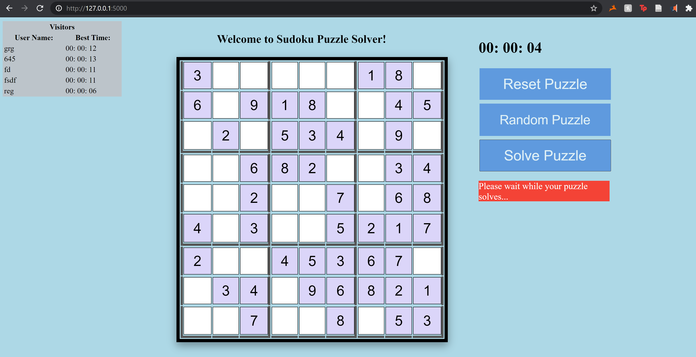
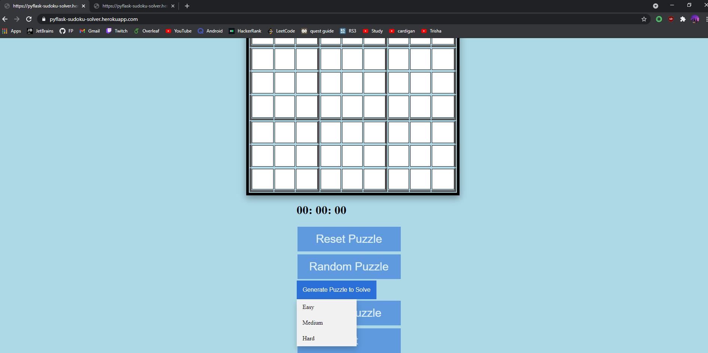

# CP476-FinalProject

## System design & implementation

### P2.1 Client side component & UI    
The following images show the completed client side components in which users will be interacting with. It shows the board in which the puzzle will be shown, a timer under the board to keep track of the highest timed scores and displays the top scores seen top left of the screen.

The following image shows an empty Sudoku board

The following image shows a completed Sudoku board

Here we see that users can choose between easy, medium or hard sudoku puzzles.

### P2.2 Server side CGI components    
We used flask to help build and interact with our web application. 

We also used AJAX for communicating with the application asynchronously. 

### P2.3 Database tier design, data, usage  
We used MongoDB to design our database. Our database holds information regarding our site visitors and their best solve times. The database information is also displayed on our web application for sudoku solver so users can compete for the best times.

### P2.4 New features and tools  
One of the new tools we used was Flask. 

One new feature we added was for the boxes to turn red when a confict occurs. Conflicts occur when certain number values are inserted in boxes where the puzzle is deemed automatically incorrect. In other words, in Sudoku no same numbers may be present within the same row, column or sub-square.

Another new tool we used was Heroku. Heroku is a cloud application platform that we used to deploy our sudoku solver. We used this site https://devcenter.heroku.com/articles/git#:~:text=To%20deploy%20your%20app%20to,heroku%20master%20Initializing%20repository%2C%20done to learn how to deploy the project correctly. We used heroku to deploy our python application, alongside our Node API implementation, and html body.

The image below shows Heroku connected to the github repository of our project that it used to deploy.

### P2.5 Problem solving algorithms
We used the backtracking and AC3 algorithms to solve unsolved sudoku puzzles. We also used the minimum remaining value heuristic to aid our alogrithms in solving. The code for these three functions are shown below.

### P2.6 Efficiency and robustness  
Our application if efficient and robust and it solves, generates and checks for correctness in puzzles with extreme accuracy and speed. It contains all features that users would want in a high quality sodoku puzzle application including a timer, the ability to add your score to the leaderboard, reset puzzles, generate puzzles at different difficulties and solves unfinished puzzles.
